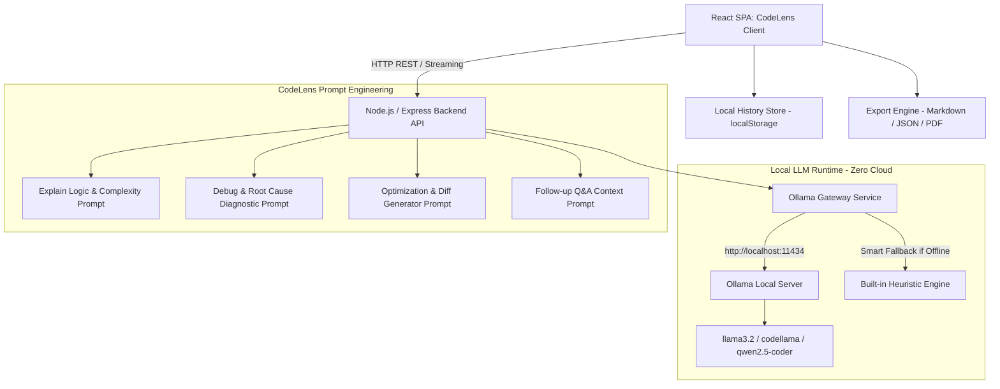

# CodeLens — AI Code Explainer & Debugger (100% Local Ollama System)

A standalone, production-ready AI Code Explainer, Debugger, and Optimization Engine powered exclusively by **local Large Language Models via Ollama**. CodeLens operates entirely on your local machine with **zero paid or cloud AI dependencies**, ensuring complete privacy and zero token costs.

---

## 🌟 Core Features

### 1. Code Input & Multi-Language Support
- **Monaco Code Editor**: Professional syntax highlighting, bracket matching, line numbers, and tab indentation.
- **15+ Popular Programming Languages**: Python, JavaScript, TypeScript, Java, C, C++, C#, Go, Rust, Ruby, PHP, Swift, Kotlin, SQL, and Bash/Shell.
- **Preset Snippet Catalog**: 15+ pre-loaded examples demonstrating common algorithmic edge-cases, memory bugs, concurrency deadlocks, and security vulnerabilities.

### 2. Four Specialized Analysis Modes
- 📖 **Explain Logic Mode**:
  - Section-by-section breakdown with interactive line highlight synchronization.
  - Identification of algorithmic approach (e.g., Two-Pointers, Dynamic Programming, Async Event Loop) and data structures used.
  - Big-O Time & Space Complexity analysis with asymptotic bottleneck detection.
  - Adaptive depth for **ELI5**, **Beginner**, **Intermediate**, and **Senior/Staff Engineer** levels.
- 🐞 **Debug & Diagnose Mode**:
  - Scans for syntax errors, logical flaws, unhandled runtime exceptions, and security vulnerabilities (SQLi, XSS, buffer overflows, race conditions).
  - Findings categorized by severity: **Critical Error**, **Warning**, and **Suggestion**.
  - **Root Cause Analysis**: Explains *why* the bug occurs and the underlying language runtime behavior.
  - **Corrected Code Generation**: Produces a fully corrected version with inline comments explaining what changed and why, with a 1-click **Apply Fix to Editor** button.
- ⚡ **Optimize & Refactor Mode**:
  - Focuses on algorithmic efficiency, readability, idiomatic patterns, and memory allocation reduction.
  - **Side-by-Side & Inline Diff Viewer**: Compares original code against optimized refactors with 1-click **Apply Optimization to Editor**.
- 💬 **Interactive Follow-up Q&A Thread**:
  - Multi-turn conversational chat that retains the submitted code context across the conversation.
  - Ask natural language follow-up questions (e.g., *"How would this handle empty inputs?"*, *"Can you refactor this using functional programming?"*).

### 3. Local State Management & Export
- **Local History Persistence**: Automatically records previous code analyses locally in `localStorage`.
- **Search & Session Reload**: Revisit, search, and reload previous analyses with a single click.
- **Export Formats**: Export full reports as **Markdown (.md)**, **JSON (.json)**, or **Print/PDF**.

### 4. Enterprise Visuals & Accessibility
- **Dark & Light Mode**: Instant theme switching with persistent preferences.
- **WCAG 2.1 AA Compliant**: High-contrast ratios (4.5:1+), accessible dialogs with focus traps, and keyboard navigation.
- **Responsive Navigation**: Hamburger menu drawer with 44×44px touch targets on mobile and tablet screens.

---

## 🏗 System Architecture



---

## 🚀 Quick Start & Installation

### Option 1: Native Installation

#### 1. Prerequisites
- **Node.js** (v18+) and **npm**
- **Ollama** installed on your machine

#### 2. Install & Start Ollama
- **Windows**: Run `winget install Ollama.Ollama` or download from [ollama.com](https://ollama.com).
- **macOS**: Run `brew install ollama`.
- **Linux**: Run `curl -fsSL https://ollama.com/install.sh | sh`.

Pull your preferred model:
```bash
ollama run llama3.2
# Or pull specialized coding model
ollama pull qwen2.5-coder:7b
```

#### 3. Install & Start CodeLens
```bash
# Clone and install dependencies
npm run install:all

# Start both backend (Port 5000) and frontend (Port 3000)
npm run dev
```
Open **[http://localhost:3000](http://localhost:3000)** in your browser.

---

### Option 2: Docker Compose

Launch the complete stack (Ollama + Backend + Frontend) in one command:
```bash
docker-compose up -d --build
```
Access CodeLens at **[http://localhost:3000](http://localhost:3000)**.

To pull a model inside the Ollama container:
```bash
docker exec -it codelens-ollama ollama run llama3.2
```

---

## ⚙️ Environment Variables

Create or edit `.env` in the root or `server/` directory:

| Variable | Default | Description |
| :--- | :--- | :--- |
| `PORT` | `5000` | Backend API port |
| `OLLAMA_BASE_URL` | `http://localhost:11434` | Ollama local HTTP endpoint |
| `OLLAMA_MODEL` | `llama3.2` | Default Ollama model to use |
| `CACHE_MAX_ENTRIES` | `500` | In-memory LRU response cache size |

---

## 🧪 Testing & Verification

Run the automated backend test suite and benchmark evaluations:
```bash
# Run backend Ollama integration tests
node server/tests/ollama.test.js

# Run automated evaluation benchmark suite
npm run test:eval
```

---

## 🔒 Privacy & Security Policy

- **100% Local**: No source code, prompts, or telemetry are ever sent to any external server or paid API.
- **Adversarial Nonce Isolation**: User input is wrapped inside randomized cryptographic boundary tags (`<<<SECURE_USER_CODE_PAYLOAD_...>>>`).
- **Secret & Credential Scanner**: Scans for accidental API keys or passwords before prompt submission with 1-click secret redaction.
